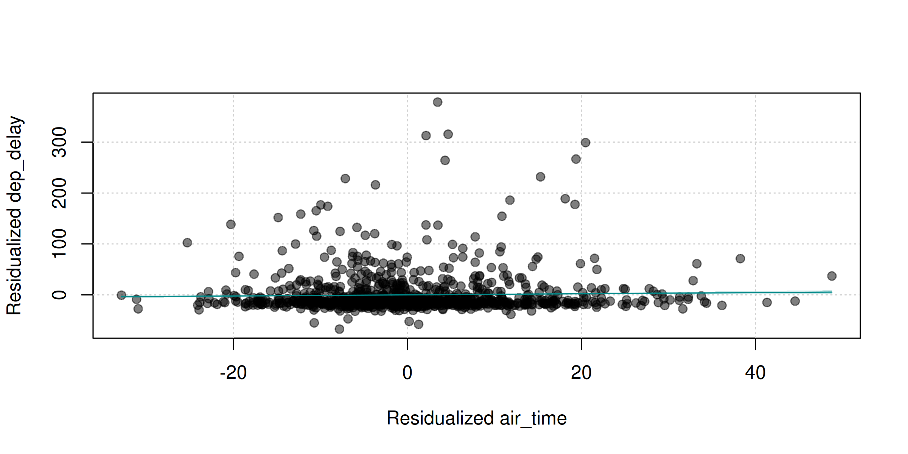
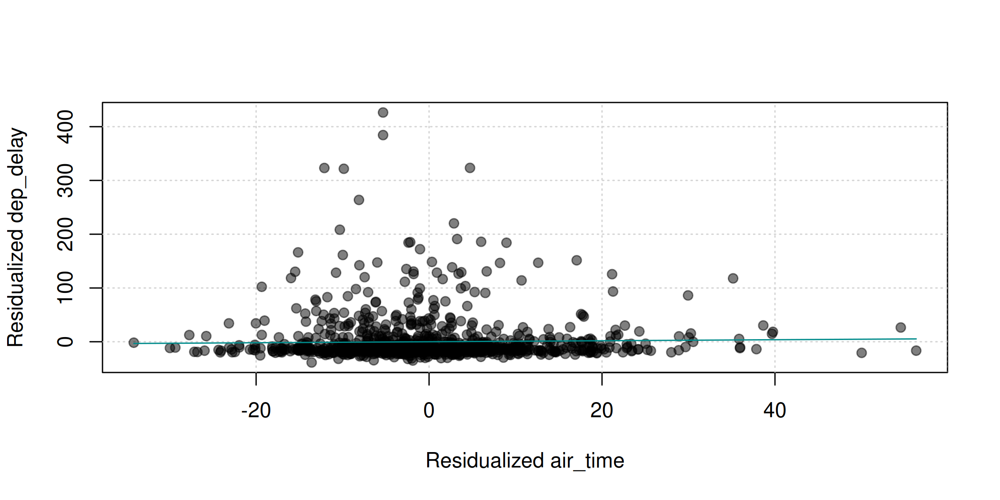
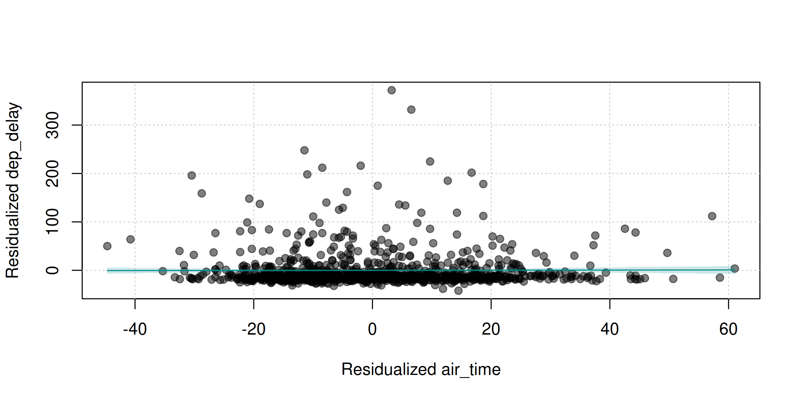
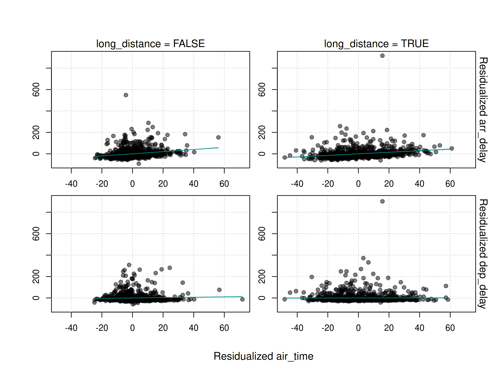
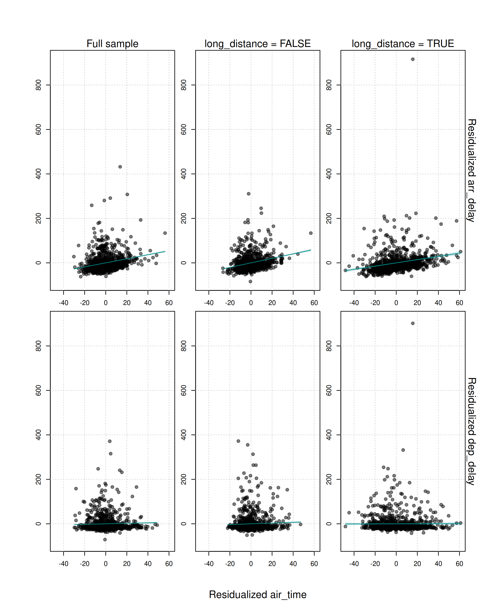
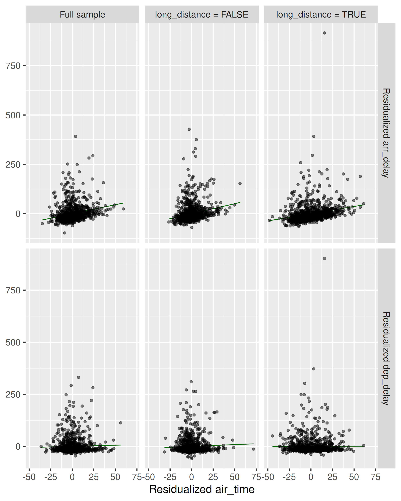

<!-- README.md is generated from README.Rmd. Please edit that file -->

# fwlplot

<!-- badges: start -->
<!-- badges: end -->

This is a super simple package to help make scatter plots of two
variables after residualizing by covariates. This package uses `fixest`
so things are super fast. This is meant to (as much as possible) be a
drop in replacement for `fixest::feols`. You should be able to replace
`feols` with `fwl_plot` and get a plot.

## Installation

You can install the development version of fwlplot like so:

``` r
devtools::install_github("kylebutts/fwlplot")
```

## Example

Here’s a simple example with fixed effects removed by `fixest`.

``` r
library(fwlplot)
library(fixest)

flights <- data.table::fread("https://raw.githubusercontent.com/Rdatatable/data.table/master/vignettes/flights14.csv")
flights$long_distance = (flights$distance > 2000)
# Sample 10000 rows
sample = flights[sample(nrow(flights), 10000), ]
```

``` r
# Without covariates = scatterplot
fwl_plot(dep_delay ~ air_time, data = sample)
```


``` r
# With covaraites = FWL'd scatterplot
fwl_plot(
  dep_delay ~ air_time | origin + dest, 
  data = sample, vcov = "hc1"
)
```



### Plot random sample

If you have a large dataset, we can plot a sample of points with the
`n_sample` argument. This determines the number of points *per plot*
(see multiple estimation below).

``` r
fwl_plot(
  dep_delay ~ air_time | origin + dest, 
  # Full dataset for estimation, 1000 obs. for plotting
  data = flights, n_sample = 1000
)
```



### Full `feols` compatability

This is meant to be a 1:1 drop-in replacement with fixest, so everything
should work by just replacing `feols` with

``` r
feols(
  dep_delay ~ air_time | origin + dest, 
  data = sample, subset = ~long_distance, cluster = ~origin
)
#> OLS estimation, Dep. Var.: dep_delay
#> Observations: 1,769 
#> Subset: long_distance 
#> Fixed-effects: origin: 2,  dest: 15
#> Standard-errors: Clustered (origin) 
#>          Estimate Std. Error  t value Pr(>|t|) 
#> air_time 0.054298   0.161423 0.336374  0.79343 
#> ---
#> Signif. codes:  0 '***' 0.001 '**' 0.01 '*' 0.05 '.' 0.1 ' ' 1
#> RMSE: 45.1     Adj. R2: 0.009314
#>              Within R2: 3.622e-4
```

``` r
fwl_plot(
  dep_delay ~ air_time | origin + dest, 
  data = sample, subset = ~long_distance, cluster = ~origin
)
```



### Multiple estimation

``` r
# Multiple y variables
fwl_plot(
  c(dep_delay, arr_delay) ~ air_time | origin + dest, 
  data = sample
)
```


``` r
# `split` sample
fwl_plot(
  c(dep_delay, arr_delay) ~ air_time | origin + dest, 
  data = sample, split = ~long_distance, n_sample = 1000
)
```



``` r
# `fsplit` = `split` sample and Full sample
fwl_plot(
  c(dep_delay, arr_delay) ~ air_time | origin + dest, 
  data = sample, fsplit = ~long_distance, n_sample = 1000
)
```



### ggplot2

``` r
library(ggplot2)
theme_set(theme_grey(base_size = 16))
fwl_plot(
  c(dep_delay, arr_delay) ~ air_time | origin + dest, 
  data = sample, fsplit = ~long_distance, 
  n_sample = 1000, ggplot = TRUE
)
```


