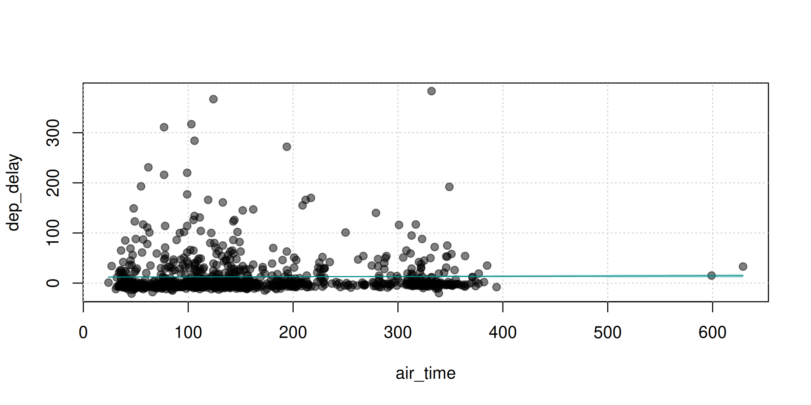

<!-- README.md is generated from README.Rmd. Please edit that file -->

# fwlplot

<!-- badges: start -->
<!-- badges: end -->

This is a super simple package to help make scatter plots of two
variables after residualizing by covariates. This package uses `fixest`
so things are super fast.

## Installation

You can install the development version of fwlplot like so:

``` r
devtools::install_github("kylebutts/fwlplot")
```

## Example

Here’s a simple example with fixed effects removed by `fixest`.

``` r
library(fwlplot)
library(fixest)
library(ggplot2)
theme_set(theme_minimal(base_size = 16))

fwl_plot(mpg ~ hp, data = mtcars)
```


``` r
fwl_plot(mpg ~ hp + wt | cyl, data = mtcars, vcov = "hc1")
```


This is meant to (as much as possible) be a drop in replacement for
`fixest::feols`. You should be able to replace `feols` with `fwl_plot`
and get a plot.

``` r
# Fixest multi support
fwl_plot(c(mpg, disp) ~ wt + hp, mtcars)
```



``` r
fwl_plot(c(mpg, disp) ~ wt + hp, mtcars, split = ~cyl)
```


``` r
fwl_plot(c(mpg, disp) ~ wt, mtcars, fsplit = ~cyl)
```


``` r

# Using subset
mtcars$sample = as.logical(mtcars$gear == 4)
fwl_plot(c(mpg, disp) ~ wt, mtcars, subset = ~sample)
```


``` r

# Using weights
mtcars$w = runif(nrow(mtcars), 0.1, 0.9)
fwl_plot(mpg ~ wt + hp, data = mtcars, weights = ~w)
```


